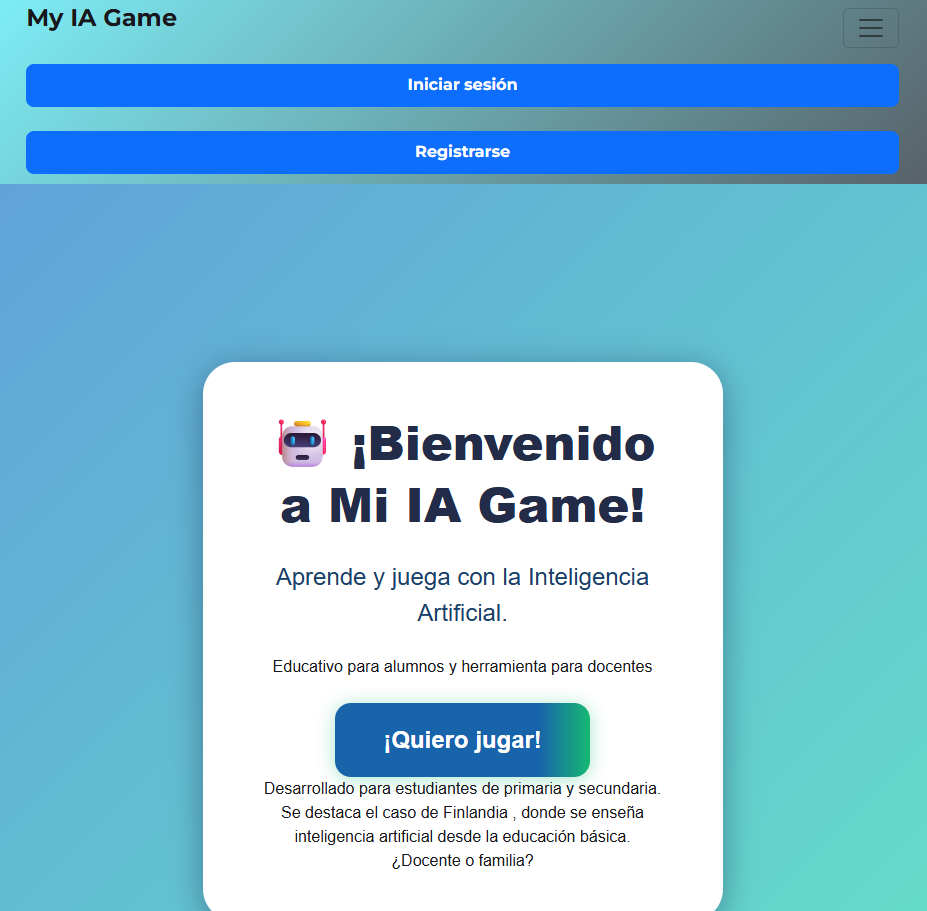
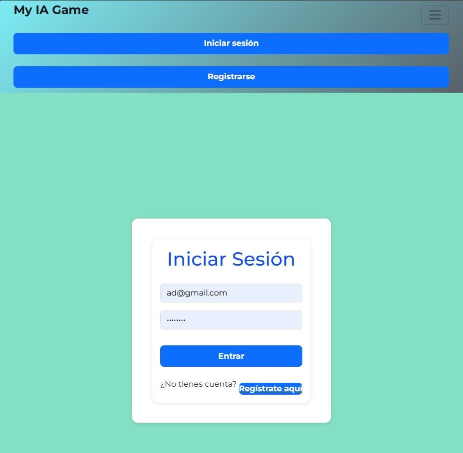
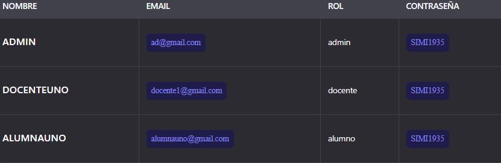

# My IA Game App

🎮 **Plataforma educativa interactiva para aprender sobre Inteligencia Artificial**

Una aplicación web completa que combina juegos educativos, gestión de usuarios, seguimiento de progreso y herramientas administrativas. Ideal para estudiantes, docentes y administradores que desean aprender IA de forma divertida y estructurada.

Este es el sitio web oficial para navegar : 
<a href="https://my-ia-game-app-f2c48d5cab78.herokuapp.com/" target="_blank" rel="noopener noreferrer">
  https://my-ia-game-app-f2c48d5cab78.herokuapp.com/
</a>




---

Como notará ha sido subido a un hosting de Heroku. Puede ingresar y jugar, usando estas credenciales :







```bash
Email                     Contraseña
ad@gmail.com              SIMI1935


Email                     Contraseña
docente1@gmail.com        SIMI1935


Email                     Contraseña
alumnauno@gmail.com       SIMI1935

```
---

## 📁 Estructura del Proyecto

```
my-ia-game-app/
├── backend/               # API REST (Node.js + Express + Prisma)
│   ├── prisma/            # Esquema, migraciones y seeds
│   ├── controllers/       # Lógica de negocio
│   ├── routes/            # Rutas API
│   ├── .env               # Variables de entorno del backend
│   └── server.js          # Servidor principal
├── frontend/              # Interfaz web (React + Bootstrap)
│   ├── public/
│   ├── src/
│   ├── .env               # Variables del frontend
│   └── package.json
├── .env                   # Variables raíz (usadas por Heroku y Prisma)
├── package.json           # Scripts globales (Heroku, seeds, etc.)
└── README.md              # Documentación principal
```


---

## 🚦 Requisitos Previos

- ✅ **Node.js** v18 o superior
- ✅ **npm** (gestor de paquetes)
- ✅ **PostgreSQL** 14+ (o acceso a RDS en la nube)
- ✅ **Git** (para clonar y gestionar versiones)
- ✅ **Prisma CLI** (instalado como `devDependency`)

---

## 🚀 Instalación y Configuración

### 1. Clonar el repositorio

```bash
git clone https://github.com/matryx-root/my-ia-game-app.git
cd my-ia-game-app
```


---
### 2. Configuración de variables de entorno

---
Ver, revisar y ajustar los datos de las 
variables de entorno
---
```bash
 📄 [.env](/my-ia-game-app/.env)
```


### 3. Instalar dependencias

```bash
# 1. Instalar dependencias globales (scripts de Heroku)
npm install

# 2. Instalar frontend
cd frontend
npm install

# 3. Volver a la raíz
cd ..

# 4. Instalar backend
cd backend
npm install
```

---

### 4. Sincronizar base de datos (Prisma)

Desde la carpeta `backend`:

```bash
# Aplicar el esquema a la base de datos
npx prisma db push --schema=prisma/schema.prisma --accept-data-loss --env-file=../.env

# Generar cliente de Prisma
npx prisma generate --schema=prisma/schema.prisma --env-file=../.env
```

---

### 5. Ejecutar seeds (datos iniciales)

Desde la **raíz del proyecto**:

```bash
cd backend/prisma/
node seed.js
npm run seed
```

> Esto carga colegios, juegos, usuarios de prueba, etc.

---

### 6. Iniciar la aplicación

#### 🖥️ Backend (API)

```bash
cd backend
npm start
```

> Servidor escuchando en: [http://localhost:5000](http://localhost:5000)

#### 🌐 Frontend (Interfaz)

En otra terminal:

```bash
cd frontend
npm start
```

> Aplicación en: [http://localhost:3000](http://localhost:3000)

---

## 👤 Usuarios de prueba

Estos son los usuarios predefinidos para probar las funcionalidades del sistema. Puedes usarlos para iniciar sesión y explorar diferentes roles.

| Nombre       | Email                | Rol     | Contraseña |
|--------------|----------------------|---------|------------|
| **ADMIN**    | `ad@gmail.com`       | admin   | `SIMI1935` |
| **DOCENTEUNO** | `docente1@gmail.com` | docente | `SIMI1935` |
| **ALUMNAUNO**  | `alumnauno@gmail.com` | alumno  | `SIMI1935` |

> ⚠️ **Nota**: Las contraseñas son todas iguales (`SIMI1935`) para facilitar el acceso durante pruebas, pero en producción deberían ser únicas y seguras.

---

## 📦 Comandos útiles

| Comando | Descripción |
|--------|-------------|
| `npm run seed` | Ejecuta los seeds (desde la raíz) |
| `npx prisma db push` | Sincroniza el esquema con la BD |
| `npx prisma generate` | Regenera el cliente de Prisma |
| `npx prisma studio` | Abre interfaz gráfica de la BD |
| `npx prisma migrate dev --name nombre_cambio` | Crea una migración |

---

## ☁️ Despliegue en Heroku

Tu `package.json` ya está configurado para Heroku:

```json
"scripts": {
  "start": "node backend/server.js",
  "heroku-postbuild": "npx prisma generate --schema=./backend/prisma/schema.prisma && cd frontend && npm install --legacy-peer-deps && npm run build",
  "seed": "node backend/prisma/seed.js"
}
```

### Pasos:

1. Crea tu app en Heroku.
2. Conecta tu repositorio.
3. Haz push:

```bash
git push heroku main
```

4. Ejecuta seeds (opcional):

```bash
heroku run npm run seed
```

---

## 🧩 Características principales

- ✅ Autenticación con JWT
- ✅ Roles: alumno, docente, admin
- ✅ Dashboard administrativo
- ✅ Seguimiento de progreso y logros
- ✅ Mensajería interna
- ✅ Configuración de tema e idioma
- ✅ Juegos educativos interactivos
- ✅ Logs de actividad y errores

---

## 🛠️ Tecnologías utilizadas

| Capa | Tecnología |
|------|-----------|
| **Frontend** | React, Bootstrap, Phaser (juegos) |
| **Backend** | Node.js, Express, Prisma, PostgreSQL |
| **Autenticación** | JWT, bcrypt |
| **Despliegue** | Heroku |
| **Base de datos** | Amazon RDS (PostgreSQL) |

---

## 📂 Scripts SQL y ERD

- 📄 [Script de creación de BD](/backend/postgreSQL/db_create.sql)
- 🖼️ [Diagrama Entidad-Relación (ERD)](/backend/postgreSQL/ERD.png)

---

## ⚠️ Notas importantes

- Asegúrate de que PostgreSQL esté corriendo antes de ejecutar `prisma db push`.
- Si modificas `schema.prisma`, ejecuta `prisma generate`.
- El `.env` no debe subirse a repositorios públicos.
- Usa `npm run seed` solo en desarrollo o pruebas.

---

## 👨‍💻 Autor

**Simón Velasquez Carcamo**  
GitHub: [@matryx-root](https://github.com/matryx-root)

---

## 📝 Licencia

Este proyecto está bajo la licencia **MIT**.  
Consulta el archivo `LICENSE` para más detalles.
```

---

