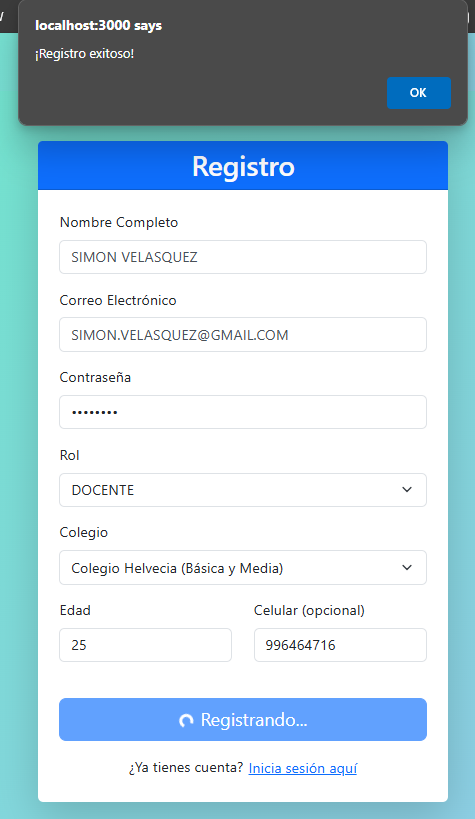
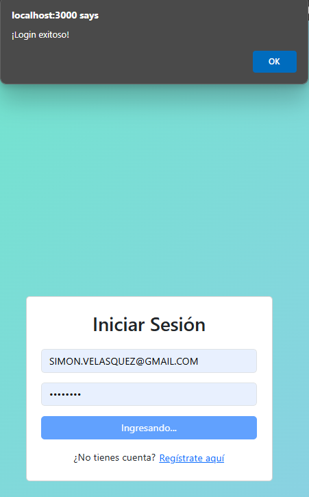
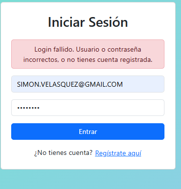
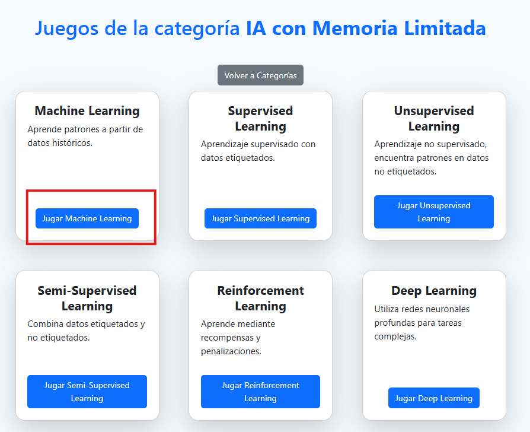
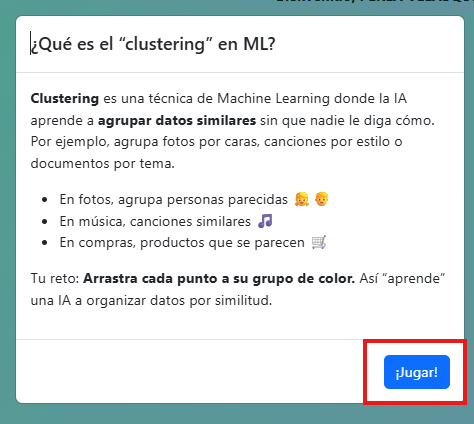
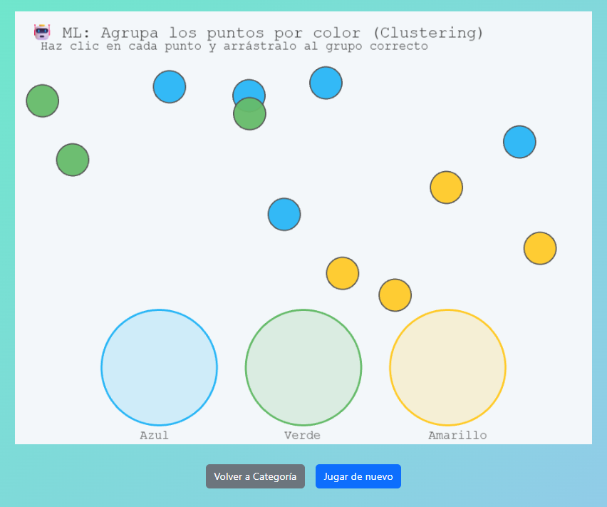
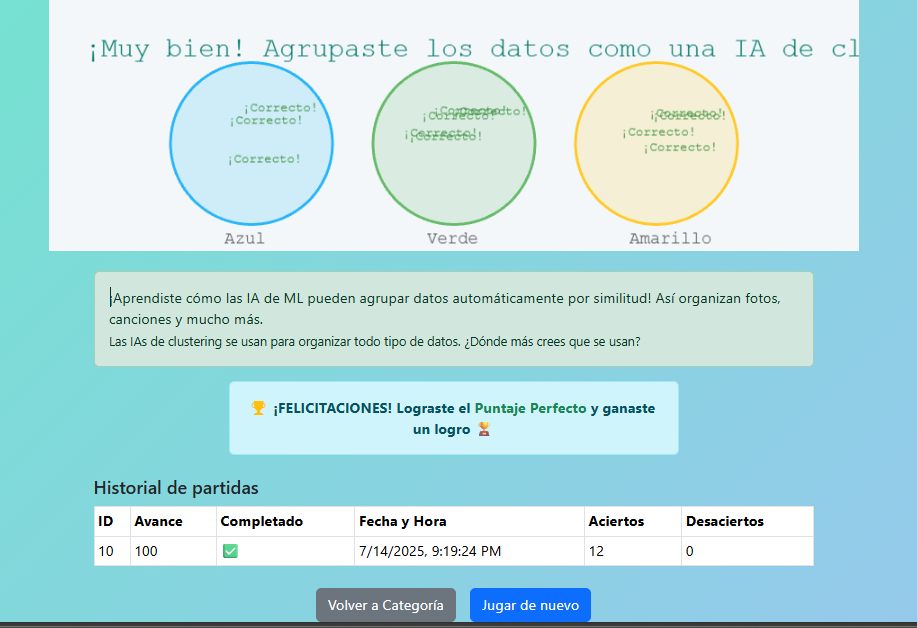
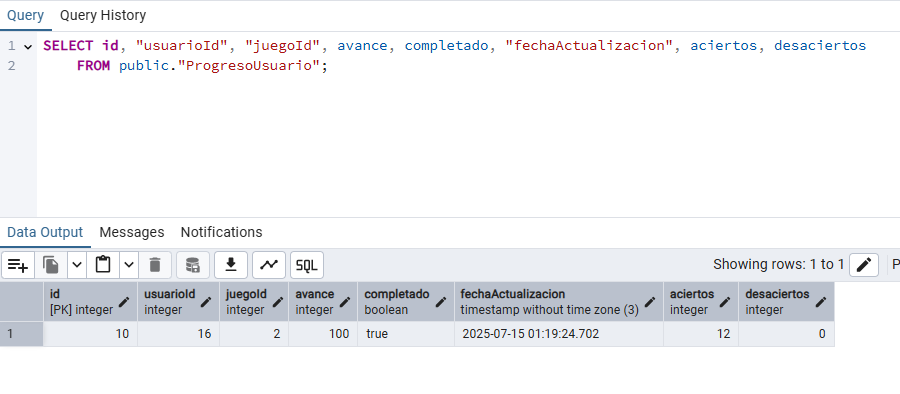

# Pruebas Manuales del Sistema

## 8.2.5 Casos de Prueba y Tareas (Manual QA)

---

### 1. Registro de usuario nuevo (alumno/docente)

- **Precondición:** El sistema está operativo. No existe el correo a registrar.
- **Pasos:**
  1. Acceder a la página de registro.
  2. Completar formulario con datos válidos.
  3. Enviar el formulario.
- **Resultado esperado:** El usuario es creado correctamente y se muestra mensaje de éxito.
- **Evidencia:**  
  

---

### 2. Login con credenciales válidas e inválidas

- **Precondición:** Usuario registrado.
- **Pasos:**
  1. Login con email y contraseña válidos.
  2. Login con contraseña incorrecta.
  3. Login con email no registrado.
- **Resultado esperado:** Acceso exitoso con credenciales válidas. Mensaje de error si inválidas.
- **Evidencia:**  
    
  

---

### 3. Selección y acceso a cada juego IA por categoría

- **Precondición:** Usuario logueado.
- **Pasos:**
  1. Ir a la pantalla de categorías.
  2. Seleccionar una categoría.
  3. Ingresar y jugar.
- **Resultado esperado:** El juego carga y es jugable.
- **Evidencia:**  
  
  
  

---

### 4. Registro de avance y puntaje al completar un juego

- **Precondición:** Usuario logueado y juego iniciado.
- **Pasos:**
  1. Completar un juego IA.
  2. Revisar el puntaje.
  3. Verificar que el avance y puntaje quedan guardados en la BD.
- **Resultado esperado:** Se guarda correctamente el puntaje/avance.
- **Evidencia:**  
  

---

### 5. Visualización de logros y estadísticas en el panel personal

- **Precondición:** Usuario ha jugado al menos un juego.
- **Pasos:**
  1. Ir al panel de usuario.
  2. Visualizar sección de logros y estadísticas.
- **Resultado esperado:** Se muestran logros y estadísticas del usuario.
- **Evidencia:**  
  

---

### 6. Envío de mensaje de soporte y validación de respuesta del admin/docente

- **Precondición:** Usuario logueado.
- **Pasos:**
  1. Acceder a “Soporte / Mensajes”.
  2. Escribir y enviar un mensaje.
  3. (Como admin/docente) responder el mensaje.
  4. (Como usuario) visualizar la respuesta.
- **Resultado esperado:** Mensaje enviado y respondido correctamente; usuario visualiza la respuesta.
- **Evidencia:**  
  

---

### 7. Modificación de configuraciones de usuario (tema, idioma)

- **Precondición:** Usuario logueado.
- **Pasos:**
  1. Acceder a “Configuración”.
  2. Cambiar tema visual y/o idioma.
  3. Guardar y verificar cambios.
- **Resultado esperado:** Se aplican y guardan los cambios de configuración.
- **Evidencia:**  
  

---

### 8. Gestión de usuarios y juegos desde el panel de administración

- **Precondición:** Usuario admin logueado.
- **Pasos:**
  1. Acceder al panel de administración.
  2. Agregar, editar y eliminar usuarios y juegos.
  3. Confirmar cambios reflejados en la BD y la interfaz.
- **Resultado esperado:** Todas las operaciones CRUD funcionan correctamente.
- **Evidencia:**  
  

---

### 9. Pruebas de interfaz en dispositivos móviles y escritorio (responsive)

- **Precondición:** Sistema desplegado y accesible.
- **Pasos:**
  1. Acceder desde PC.
  2. Acceder desde smartphone/tablet.
  3. Navegar por todas las vistas.
- **Resultado esperado:** La UI es responsiva y usable en todas las resoluciones.
- **Evidencia:**  
    
  

---

### 10. Simulación de caídas de red y validación de manejo de errores

- **Precondición:** Usuario logueado, sistema activo.
- **Pasos:**
  1. Desconectar la red durante operaciones (guardar, enviar mensaje).
  2. Intentar acciones.
  3. Reconectar y validar recuperación.
- **Resultado esperado:** El sistema muestra errores claros y no pierde datos críticos.
- **Evidencia:**  
  

---

### 11. Validación de logs de auditoría (ingreso, errores, acciones relevantes)

- **Precondición:** Acceso a dashboard admin o BD/logs.
- **Pasos:**
  1. Realizar ingreso y acciones críticas.
  2. Consultar logs de la BD o panel.
- **Resultado esperado:** Las acciones relevantes quedan registradas.
- **Evidencia:**  
  

---

## Notas

- Guarda tus evidencias en la carpeta `/test/evidencias/` (o cambia el path si es necesario).
- Si quieres usar checklist para cada prueba, reemplaza los bullets `-` por `- [ ]` en los pasos.
- Puedes personalizar los nombres de los screenshots o agregar subcarpetas si tu repositorio crece.
